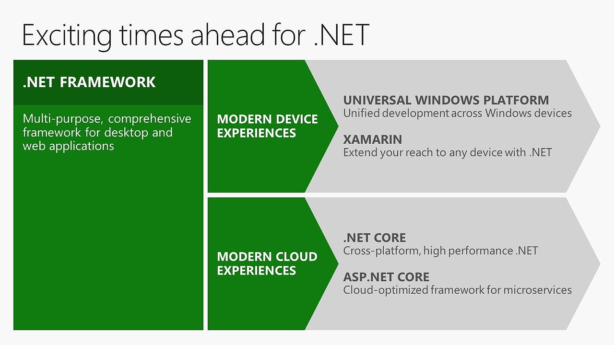
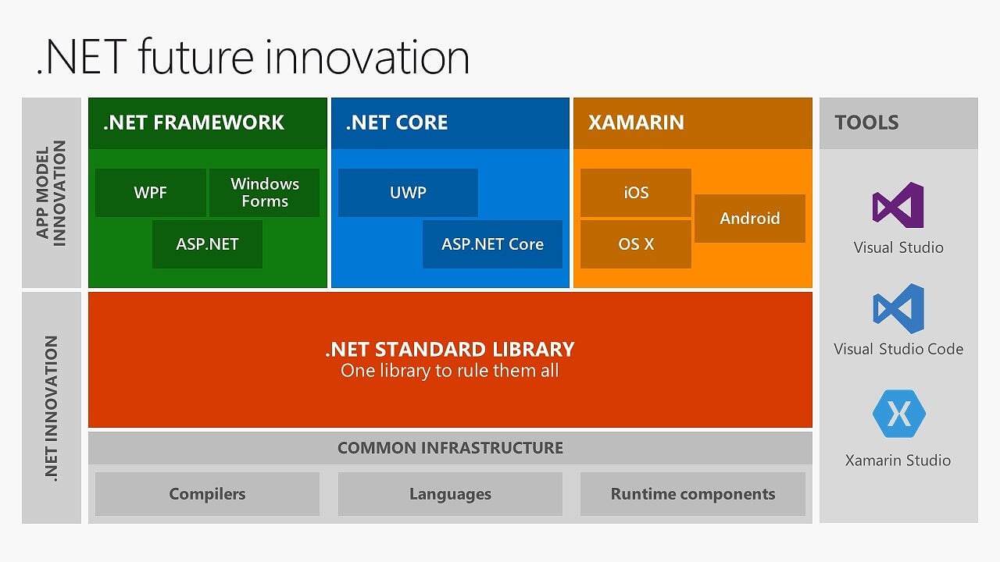
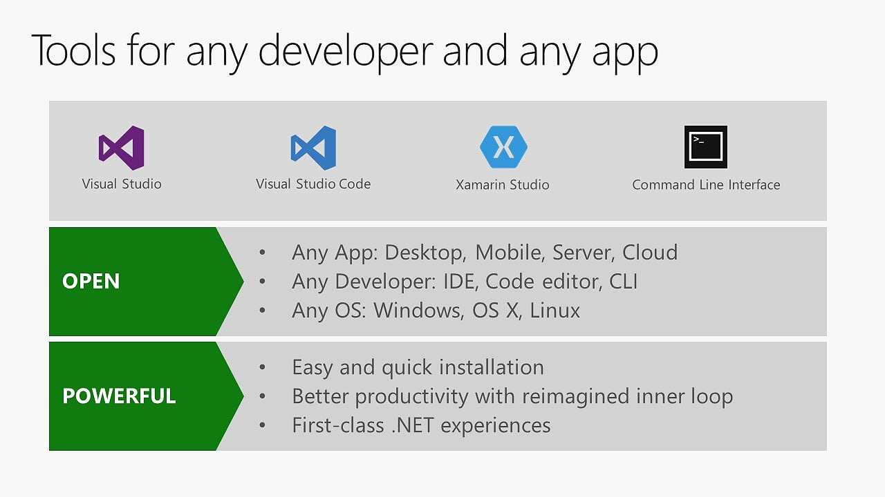

Introduction to .NET Core
==========================

> This article contains exceprts from [a MSDN Magazine on .NET Core](https://msdn.microsoft.com/en-us/magazine/mt694084.aspx) and from [the Official Microsoft Documentation](https://docs.microsoft.com/en-us/dotnet/articles/core/index)

> Many people mean “.NET Framework” when they say “.NET,” but there’s more to it than that. .NET is an ECMA standard that has different implementations—.NET Framework, Mono, Unity and, now, .NET Core. This means that many of the experiences are shared between the .NET Framework and .NET Core. However, .NET Core is new, with some different principles in mind.

> First, .NET Core is cross-platform. It runs on Windows, OS X and multiple distributions of Linux. It also supports different CPU architectures. We’re adding more Linux distribution and CPU architecture support with the eventual goal of .NET Core running in as many places as possible.

> At the same time, .NET Core is fundamentally modular in its design and architecture. The runtime, library and compiler components are all separate entities that communicate through well-designed interfaces. This allows you to “swap” components in and out for your particular needs. The libraries themselves are also modular and distributed via NuGet, letting you use only what you need so that you can fine-tune the footprint of .NET Core on any given system.

What is .NET Core?
------------------

.NET Core is a general purpose development platform maintained by Microsoft and the .NET community on GitHub. It is cross-platform, supporting Windows, macOS and Linux, and can be used in device, cloud, and embedded/IoT scenarios.
The following characteristics best define .NET Core:
- Flexible deployment: Can be included in your app or installed side-by-side user- or machine-wide.
- Cross-platform: Runs on Windows, macOS and Linux; can be ported to other operating systems. The supported Operating Systems (OS), CPUs and application scenarios will grow over time, provided by Microsoft, other companies, and individuals.
- Command-line tools: All product scenarios can be exercised at the command-line.
- Compatible: .NET Core is compatible with .NET Framework, Xamarin and Mono, via the .NET Standard Library.
- Open source: The .NET Core platform is open source, using MIT and Apache 2 licenses. Documentation is licensed under CC-BY. .NET Core is a .NET Foundation project.
- Supported by Microsoft: .NET Core is supported by Microsoft, per .NET Core Support

Basically, Microsoft built a version of .NET to allow developers to write cross-platform and cloud-optimized applications.

First, .NET is cross-platform. It runs on Windows, macOS and Linux, which allows the developer to share and run the exact same code between machines running different operating systems, with no changes in code and minimum or no changes in the deveopment process. (Watch out for OS specific APIs!)

But the true innovation in .NET came with the modularization in design and architecture. The compiler (Roslyn) and the runtime (CoreCLR) are separate components that allow you to use different implementations (or even write your own).

Every library comes as a NuGet package, so when you start a new project, you don't have any libraries, but a project file (`.csproj`) and a `Program.cs`. As you develop your app, you add libraries as you need them, allowing you to minimize the size of your application.

.NET Core also allows you to have multiple versions installed at the same time without having apps / parts of the OS breaking when you update or install a newer version of the framework, and will even allow you to ship the framework / parts of the framework with the application (since the footprint of the framework si small enough).

> .NET Core will favor performance with a standard library that minimizes allocations and the overall memory footprint of your system. [The complete MSDN article](https://msdn.microsoft.com/en-us/magazine/mt694084.aspx).

Scenarios for .NET Core
----------------------------
- [Universal Windows Apps](https://developer.microsoft.com/en-us/windows/develop/building-universal-windows-apps) that run on all various Windows versions (on laptops, tablets, phones, IoT devices, xBox, HoloLens)

- [Xamarin Apps](https://www.xamarin.com/platform) that run on Android, iOS and macOS using the same shared C# code

- [.NET Core](https://docs.microsoft.com/en-us/dotnet/articles/core/index) - cross-platform console applications and libraries

- [ASP .NET Core](https://docs.asp.net/) - cross-platform web applications that run on Windows (inside IIS and with the dedicated web server - Kestrel), macOS and Linux (with the dedicated web server - Kestrel) with [superior performance](http://web.ageofascent.com/asp-net-core-exeeds-1-15-million-requests-12-6-gbps/) compared to the standard ASP .NET 4.6 or to Node.

So right now, using C# and .NET you can build almost any type of application and target multiple frameworks.

.NET Standard - One library to rule them all
----------------------------------------------------

The .NET Standard Library is a formal specification of .NET APIs that are intended to be available on all .NET runtimes. The motivation behind the Standard Library is establishing greater uniformity in the .NET ecosystem. ECMA 335 continues to establish uniformity for .NET runtime behavior, but there is no similar spec for the .NET Base Class Libraries (BCL) for .NET library implementations. 

The .NET Standard Library enables the following key scenarios: 

 - Defines uniform set of BCL APIs for all .NET platforms to implement, independent of workload.

- Enables developers to produce portable libraries that are usable across .NET runtimes, using this same set of APIs.

 - Reduces and hopefully eliminates conditional compilation of shared source due to .NET APIs, only for OS APIs.

More on the .NET Standard Library on the [Official Microsoft Documentation](https://docs.microsoft.com/en-us/dotnet/articles/standard/library).

The goal of .NET Standard is to have a single, unified set of libraries that you target when building an application, regardless of the type - console, web or mobile - you simply target .NET Standard and you are guaranteed that libraries there will work when shared across all platforms.

This is the part of the framework most of the work will take place in the future and you can follow the progress or contribute in [this GitHub repository](https://github.com/dotnet/corefx).

Tools
------

Historically, .NET developers didn't have to (or couldn't) use the command line so often. Visual Studio took care of most processes involved in building and running the applications.

But with the open-source of .NET Core, all development efforts became CLI-first, so everything involved in building, compiling or running .NET Core applications can be done using the command line. 

In fact, all these things were built for the command line first and then were wrapped in the multiple tools available.

Regardless of the OS, you use the same command line interface (which is also [open source and available on GitHub](https://github.com/dotnet/cli)) to create new apps, build, or run.

[Visual Studio Code](https://www.visualstudio.com/en-us/products/code-vs.aspx) is the cross-platform code editor for Linux, macOS and Windows. With VS Code you can build, debug and run web applications (ASP .NET Core, Node) or .NET Core console applications, with IntelliSense, code completion and Git integration.

>Using [OmniSharp](http://www.omnisharp.net/) you can add IntelliSense to any of the following code editors - Atom, Brackets, Emacs, Sublime or Vim.

[Xamarin Studio](https://www.xamarin.com/studio) is the IDE for macOS that lets you build cross-platform mobile applications for iOS, Android or macOS, and even web applications.

With [Visual Studio Community](https://www.visualstudio.com/products/visual-studio-community-vs) you can build all types of applications on the .NET Framework, including Xamarin apps, Azure integration and source control support. For Windows, it is the best IDE for building .NET applications.

Conclusion
-------------

[You can install .NET Core on your system right now](https://www.microsoft.com/net) and start using the command line interface (`dotnet new`, `dotnet restore`, `dotnet build`, `dotnet run`) or install [Visual Studio Code](https://www.visualstudio.com/en-us/products/code-vs.aspx) with IntelliSense and debugging.

It is one of the most exciting times to be a .NET developer, being able to write code that runs across IoT devices, phones, tablets, laptops, desktops, holographic devices, servers or the cloud and share it across multiple operating systems, with familiar processes and tools.

Useful links and documentation
------------------------------

- [Microsoft .NET documentation page](https://docs.microsoft.com/en-us/dotnet/)
- [C# Fundamentals repository on GitHub](https://github.com/microsoft-dx/csharp-fundamentals)

- [.NET Core Guide](https://docs.microsoft.com/en-us/dotnet/articles/core/)

- [Visual Studio 2017](https://www.visualstudio.com/vs/whatsnew/)
- [Visual Studio Code](https://code.visualstudio.com/)